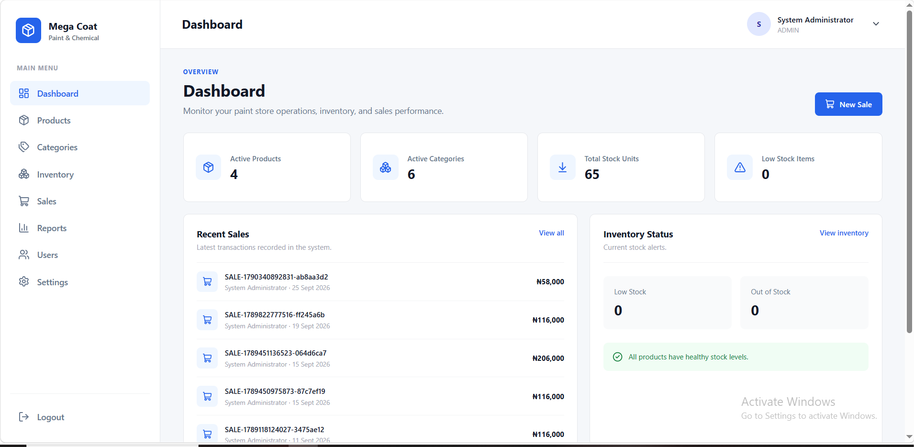
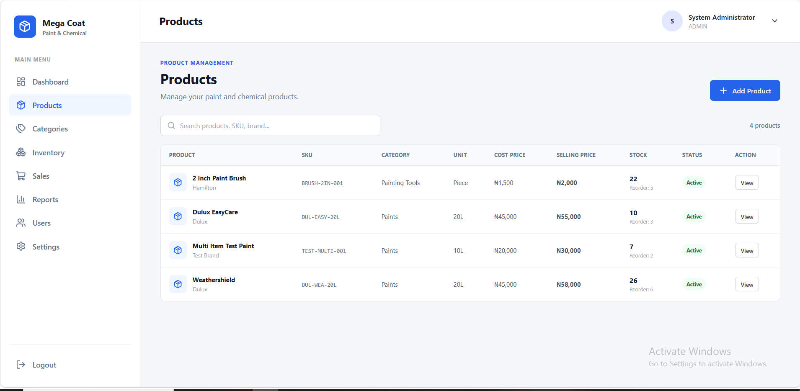
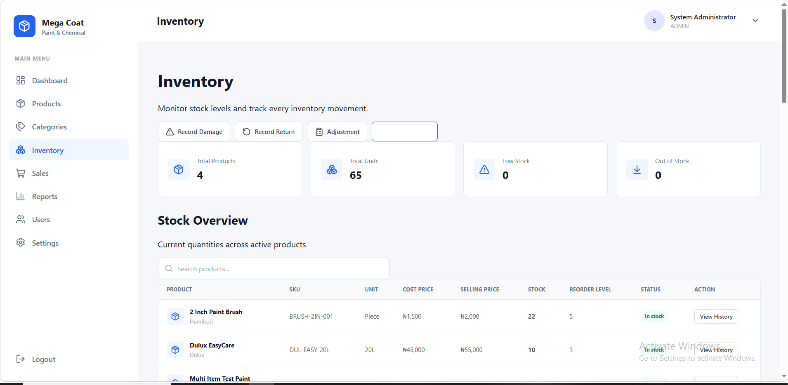
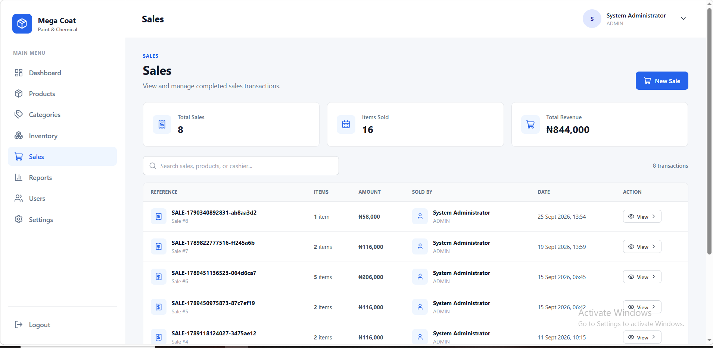
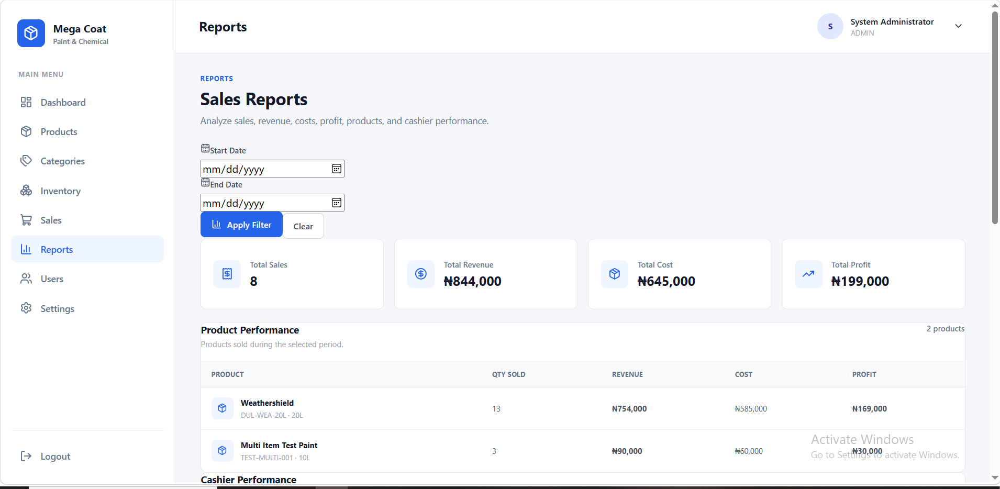

# Mega Coat Paint & Chemical Management System

A full-stack paint store management system designed to manage products, categories, inventory, sales, users, and business reporting.

## Overview

Mega Coat Paint & Chemical Management System is a local business management application built for paint and chemical stores.

The system provides role-based access for administrators and cashiers, product management, inventory tracking, stock movement management, sales processing, reporting, and store configuration.

The application is designed to run locally using SQLite for reliable offline business operations.

## Features

### Authentication and Authorization

- JWT-based authentication
- Admin and cashier roles
- Protected API routes
- Role-based access control
- Active and inactive user accounts
- Password hashing with bcrypt
- Authentication rate limiting
- Protected administrative endpoints

### Dashboard

- Active product overview
- Active category overview
- Total stock units
- Low-stock monitoring
- Recent sales
- Inventory status
- Quick access to sales

### Product Management

- Create products
- View product details
- Search products
- SKU management
- Brand management
- Category assignment
- Unit management
- Cost price management
- Selling price management
- Reorder level configuration
- Product activation and deactivation
- Opening stock tracking

### Category Management

- Create categories
- View categories
- Search categories
- Activate and deactivate categories
- Assign products to categories

### Inventory Management

- Current stock levels
- Stock overview
- Stock movement history
- Purchase stock
- Stock returns
- Stock adjustments
- Damage adjustments
- Stock-out protection
- Insufficient-stock validation
- Automatic stock movement records
- Transaction-based stock updates

### Sales Management

- Create sales
- Multiple products per sale
- Automatic stock reduction
- Sale references
- Sales history
- Sale details
- Automatic subtotal calculations
- Automatic total calculations
- Cost tracking
- Profit tracking

### Reports

- Total sales
- Total revenue
- Total cost
- Total profit
- Product sales performance
- Quantity sold
- Revenue by product
- Cost by product
- Profit by product
- Date filtering

### User Management

- Create users
- Admin and cashier roles
- Activate users
- Deactivate users
- User status management
- Protected administrative access

### Store Settings

- Store name
- Business type
- Address
- Phone number
- Email
- Currency settings

## Screenshots

### Dashboard



### Products



### Inventory



### Sales



### Reports



## Technology Stack

### Frontend

- React
- TypeScript
- Vite
- React Router
- Lucide React

### Backend

- Node.js
- Express.js
- TypeScript
- Prisma ORM
- SQLite
- JWT
- bcryptjs
- Helmet
- CORS
- Express Rate Limit

## Project Structure

```text
mega-coat-paint-management-system/
├── backend/
│   ├── prisma/
│   │   ├── migrations/
│   │   └── seed.ts
│   ├── src/
│   │   ├── config/
│   │   ├── controllers/
│   │   ├── middlewares/
│   │   ├── routes/
│   │   ├── services/
│   │   └── generated/
│   ├── .env.example
│   ├── package.json
│   └── tsconfig.json
│
├── frontend/
│   ├── public/
│   ├── src/
│   │   ├── components/
│   │   ├── context/
│   │   ├── pages/
│   │   ├── services/
│   │   └── utils/
│   ├── .env.example
│   ├── package.json
│   └── vite.config.ts
│
├── screenshots/
│   ├── dashboard.png
│   ├── products.png
│   ├── inventory.png
│   ├── sales.png
│   └── reports.png
│
└── README.md
Requirements

Before running the project, install:

Node.js 20 or later
npm
Git
Installation

Clone the repository:

git clone https://github.com/mustyJose/mega-coat-paint-management-system.git

Enter the project directory:

cd mega-coat-paint-management-system
Backend Setup

Enter the backend directory:

cd backend

Install dependencies:

npm install

Create the environment file:

Copy-Item .env.example .env

Open .env and configure:

PORT=3000
NODE_ENV=development
DATABASE_URL="file:./dev.db"
JWT_SECRET="your-secure-jwt-secret"
JWT_EXPIRES_IN="8h"
SEED_ADMIN_PASSWORD="your-secure-admin-password"

Generate Prisma Client:

npx prisma generate

Create the database and apply migrations:

npx prisma migrate dev

Seed the initial administrator account:

npm run db:seed

Start the backend:

npm run dev

The backend API will run at:

http://localhost:3000
Frontend Setup

Open another terminal and return to the project root:

cd ..

Enter the frontend directory:

cd frontend

Install dependencies:

npm install

Create the environment file:

Copy-Item .env.example .env

Configure the frontend environment:

VITE_API_URL=http://localhost:3000/api

Start the frontend:

npm run dev

The frontend will normally be available at:

http://localhost:5173
Production Builds
Backend

From the backend directory:

npm run build
Frontend

From the frontend directory:

npm run build
API

The backend provides REST API endpoints for:

/api/auth
/api/categories
/api/products
/api/inventory
/api/dashboard
/api/sales
/api/users

Authenticated requests use Bearer tokens:

Authorization: Bearer <token>
User Roles
Administrator

Administrators can:

Manage users
Manage categories
Manage products
Manage inventory
Process sales
View reports
Manage store settings
Cashier

Cashiers can:

View the dashboard
View products
View categories
Perform inventory operations
Process sales
Access store settings

Administrative features such as user management and sales reports are restricted to administrators.

Security

The application includes:

JWT authentication
HS256 algorithm restriction
Password hashing
Role-based authorization
Active-user validation
Authentication rate limiting
API rate limiting
Helmet security headers
CORS configuration
Request body size limits
Protected administrative endpoints
Transaction-based stock updates
Insufficient-stock protection
Environment-based secrets

Sensitive environment files and the local SQLite database are excluded from version control.

Database

The application uses SQLite with Prisma ORM for local data storage.

The local database file is intentionally excluded from Git.

Prisma migrations are stored in:

backend/prisma/migrations/
Testing

The application has been tested for:

Authentication
Invalid authentication tokens
User activation and deactivation
Role-based authorization
Product creation
Duplicate SKU validation
Category management
Stock receiving
Stock adjustments
Stock returns
Damage adjustments
Insufficient stock handling
Sales processing
Automatic stock reduction
Sales reporting
Profit calculations
User management
Frontend navigation
Production builds
Development Commands
Backend
npm run dev
npm run build
npm run start
npm run db:seed
Frontend
npm run dev
npm run build
npm run preview
Project Status

The core Mega Coat Paint & Chemical Management System is complete and has passed functional testing and production build verification.

Author

Mustapha Salawu

BSc Computer Science

GitHub: https://github.com/mustyJose